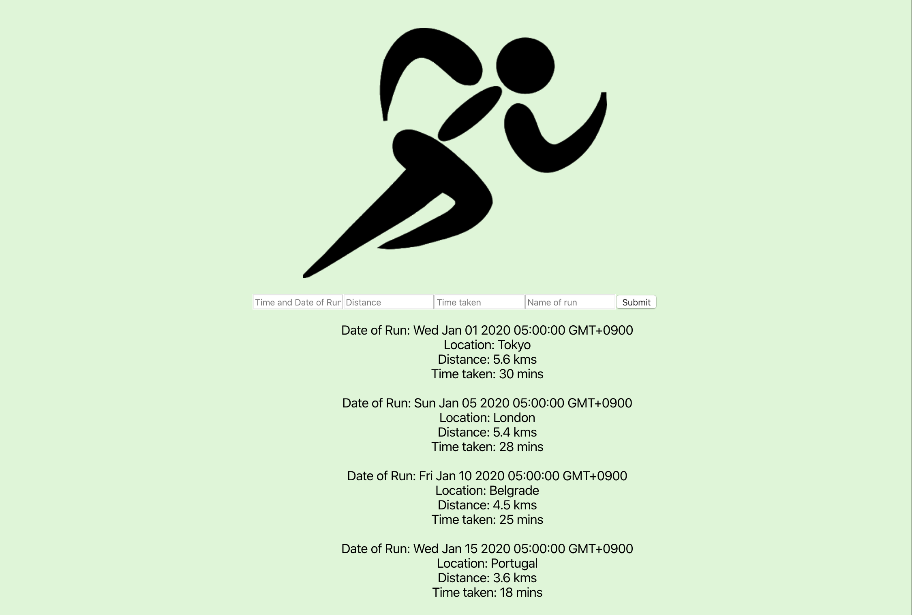
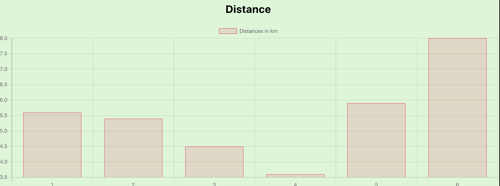
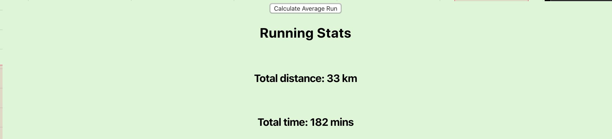

This was created during my time as a student at Code Chrysalis


Runlog was created as a solo MVP project. 

It was created for an end user who would like to log and store their running statistics and visualise their data.







## Setup Instructions
1. Clone the repo:  
```
git clone https://github.com/djrcoder/solo-mvp-cc.git
```
2. Install packages:  
```
yarn
```

3. Add your postgres config to the .env file
```
DATABASE_URL = postgresql+psycopg2://{Your database username}:password@localhost/runlog

```

4. Create a database called runlog within postgres and grant the relevant permissions to your user


5. Migrate and seed your data:  
```
yarn knex migrate:latest
```
```
yarn knex seed:run
```

6. Build:  
```
yarn build
```

7. Start the server:  
```
yarn start
```

8. Open the app at http://localhost:5000/


## Endpoints

### GET /api/runlog  
Return all data  


### POST /api/runlog/log  
Submit data 

```
